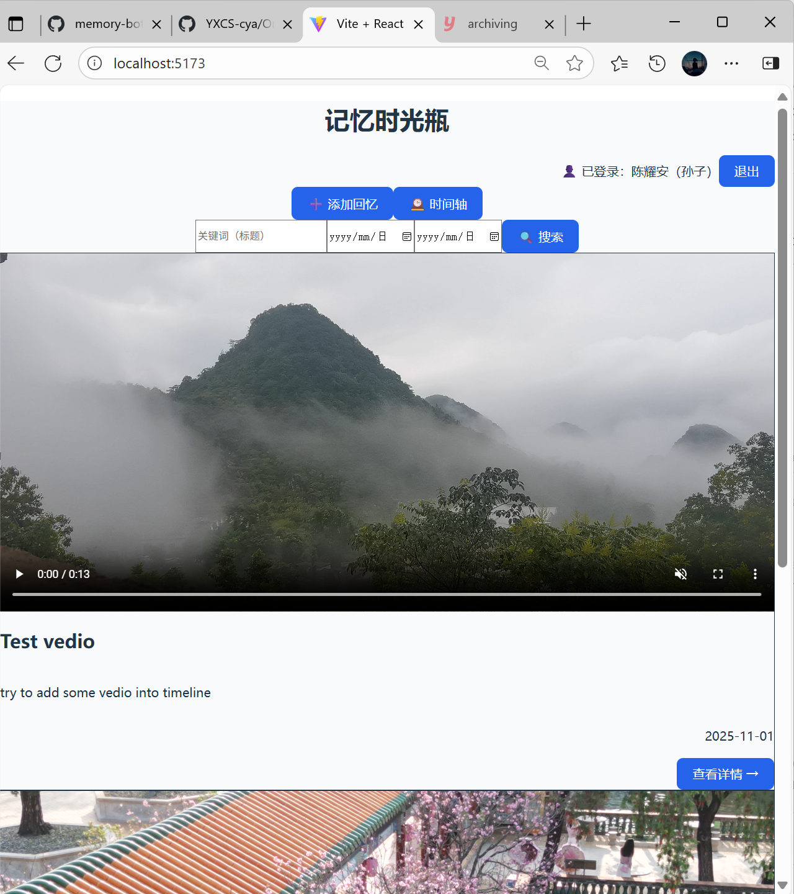
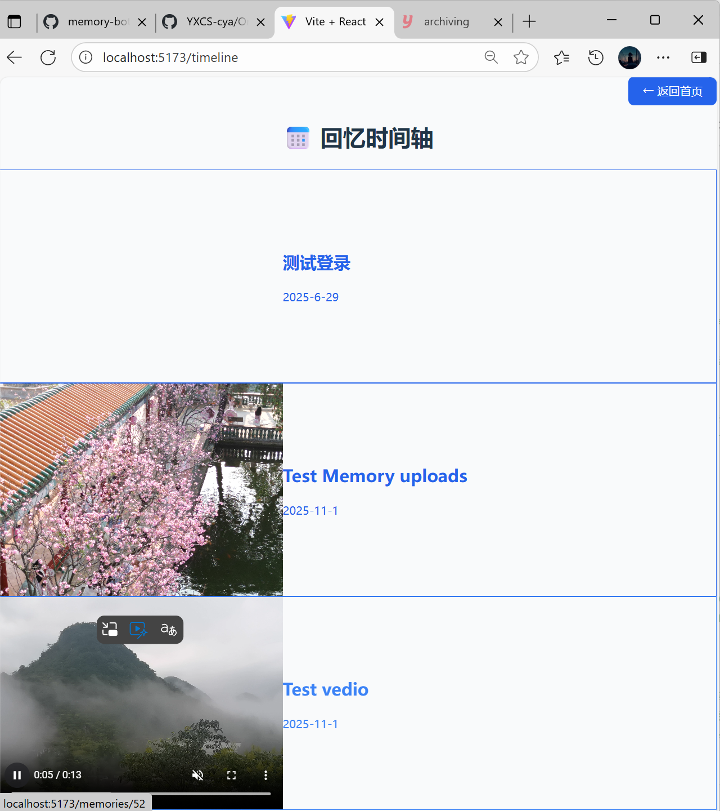
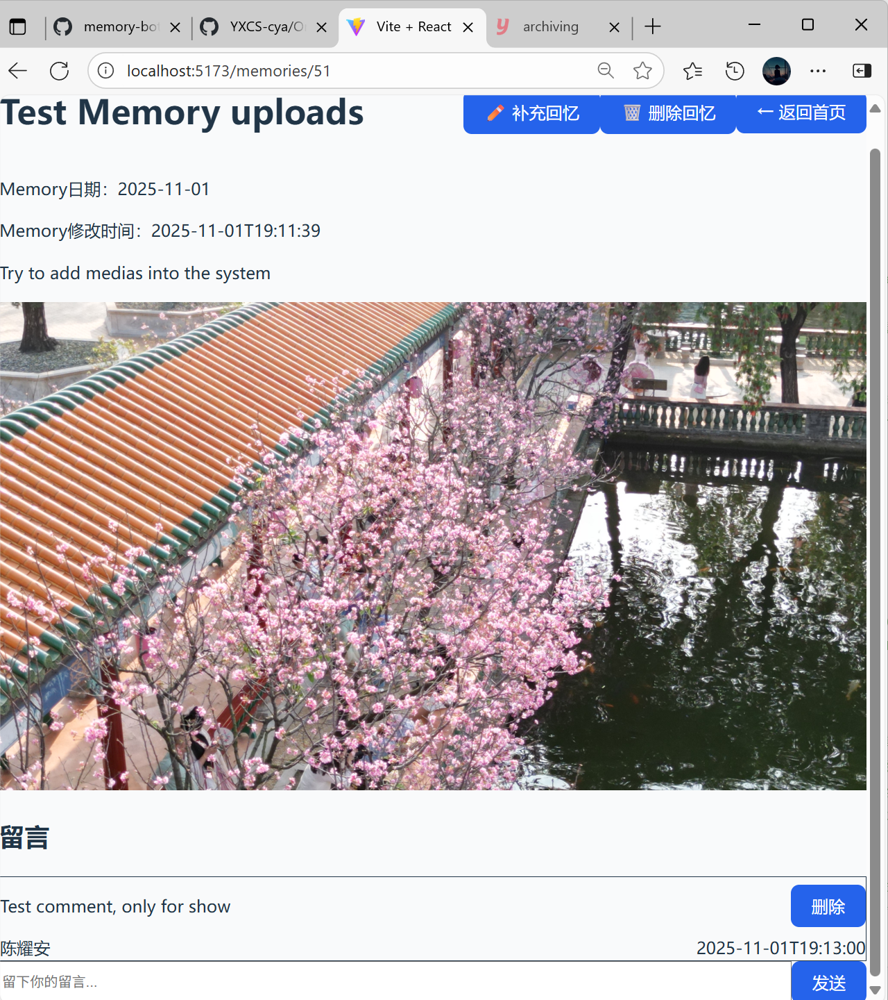

# 🖼 Memory Bottle (Frontend)

> React + Vite single-page web client for “Memory Bottle”, a family memory archiving platform designed to preserve stories, photos, and moments for elderly users — including those affected by memory loss and Alzheimer’s.  
> This frontend provides the timeline UI, upload form, memory detail view, comment interaction, and permission-aware actions.

---

## 🎯 Project Background


For many elderly people — especially those experiencing memory decline or Alzheimer’s — past family moments, photos, and shared stories are an important part of identity and emotional comfort.  
**Memory Bottle** was designed to help families record, revisit, and interact with these memories in a digital way.

This repository contains the **frontend web client** of the project.  
While the backend manages storage and access control, the frontend focuses on **presenting memories through an intuitive, accessible, and visually calm interface**
— allowing users to browse their memories, view the timeline, and share emotions through comments and media.

The backend service (Spring Boot + MySQL) is in a separate repository and exposes the REST API consumed here.
> 🔗 Backend Repository: [Memory Bottle (Backend)](https://github.com/YXCS-cya/memory-bottle)

---

## 🌟 Key Features
<p align="center">
  🎥 <b>Demo Preview</b><br>
  <a href="https://github.com/YXCS-cya/memory-bottle-frontend/tree/main/docs/media">
    👉 Click here to view the short Memory Bottle demonstration (GIF / Video)
  </a>
</p>

### 🏠 Home / Memory Feed
- Displays all memories (text + media preview: image / video).
- Shows who posted it and when.
- Search bar supports:
  - keyword search (fuzzy match by title)
  - date range filter
- “Add Memory” button opens the upload flow.
- “Timeline” button jumps to chronological view.
- Logged-in user info and logout control shown in the header.

> Screenshot: `Home view`  


---

### 📅 Timeline View
- Shows a clean chronological timeline of important memories.
- Each item shows title, event date, and links to detail.
- Designed for “looking back” mode — especially useful for elderly review or family storytelling moments.

> Screenshot: `Timeline view`  


---

### 📖 Memory Detail Page
- Shows full memory content (description, timestamp, media list).
- Displays associated photos/videos.
- Includes a comment section: family members can leave messages.
- Action buttons:
  - “Edit Memory”
  - “Delete Memory”
  - “Add Note / Supplement”
- These actions are **permission-aware** (see below).

> Screenshot: `Memory Detail view`  


---

### ⬆ Upload / Edit Memory
- Allows adding a new memory entry with:
  - title / description
  - event date
  - media uploads (image or video)
- Supports attaching multiple media files.
- Uses Axios to send multipart/form-data to the backend.

> Screenshot placeholder: `Upload form`  


---

### 💬 Comment Area
- Each memory page includes a comment thread.
- Shows existing messages; supports posting new comments.
- Uses the backend `/comments` API.
- Updates are immediately reflected in UI.

---

### 🔐 Permission & Role Awareness
- Header tracks the current user (“Logged in as ...”).
- Certain buttons are only visible to:
  - the memory owner
  - or an admin-like role
- For example, a not-logged-in viewer can still read a memory, but will not see “Delete Memory”.

> This logic mirrors backend access control based on `X-User-Id` and `is_admin`.

---

## 🧠 Tech Stack

| Area            | Tech / Library                          |
|-----------------|-----------------------------------------|
| Framework       | React (Hooks)                           |
| Bundler / Dev   | Vite                                    |
| Styling         | Tailwind CSS                            |
| HTTP / API      | Axios (calls Spring Boot backend)       |
| State / Logic   | Local component state + props           |
| Runtime         | Browser SPA (Single Page Application)   |

---

## 🗂 Project Structure

```text
memory-bottle-frontend/
├─ public/
├─ src/
│  ├─ Home.jsx            # main feed with search, filters, latest memories
│  ├─ Timeline.jsx        # chronological timeline view
│  ├─ MemoryDetail.jsx    # full detail, media, comment area, action buttons
│  ├─ MemoryEdit.jsx      # edit / supplement an existing memory
│  ├─ Upload.jsx          # create new memory with text + media upload
│  ├─ Login.jsx           # mock login / role simulation
│  ├─ CommentTest.jsx     # comment interaction logic
│  ├─ App.jsx             # main app wrapper
│  ├─ assets/             # icons, static assets
│  └─ styles (Tailwind)   # inline utility classes for styling
├─ package.json
├─ vite.config.js
└─ tailwind.config.js
```
This project is intentionally structured as a standalone frontend.  
It communicates with the backend strictly through REST endpoints, keeping the UI layer independent and easy to deploy separately.  

## 🔌 API Integration

The frontend talks to the backend through REST endpoints such as:

- GET /memories — list / search memories
- GET /timeline — timeline preview (title, eventDate, coverUrl)
- GET /memories/{id} — memory detail
- POST /memories/upload — create new memory with media
- POST /comments — add comment

Requests are made using Axios.  
For authenticated actions, the client attaches a user identifier (e.g. in headers).  
Visibility of edit/delete buttons in the UI reflects the same permission logic enforced by the backend.  

## 🔐 Permission Handling in UI
- The header shows the currently “logged in” user.
- Different roles (normal family member vs. admin-like user) see different actions.
- If the viewer is not allowed to edit/delete a memory, those buttons are hidden in the detail page.
- This mirrors backend-side checks such as checkPermission(userId, ownerId).

This is especially important in a family archive context:  
you can safely let relatives browse memories without giving them destructive access.  

## 🚀 How to Run Locally
1.Install dependencies:
```bash
npm install
```
2.Start the dev server:
```bash
npm run dev
```
3.By default Vite will start at:
```text
http://localhost:5173
```
4.The frontend expects the backend (Spring Boot service) to be running locally and accepting requests (e.g. on port 8081).
- API base URLs are called via Axios.
- For browser usage, the backend should allow CORS or you can configure a local proxy.

## 📦 Build for Production

To generate a production build:
```bash
npm run build
```
The compiled static assets will be placed in `dist/.`  
They can then be served by any static host (Nginx, CDN, etc.) or integrated into a full deployment pipeline.  

## 🧩 Future Work

- Add proper authentication (JWT-based login instead of mock header identity)
- Add richer media preview (gallery / lightbox)
- Add “guided memory prompts” to help older users or family members record stories

---
## 🛠 Build & Run Note

This project can be launched directly from source using any modern Node.js environment.  
The frontend is a standalone React + Vite SPA and communicates with the Spring Boot backend over REST.  
Detailed setup steps are provided above in "🚀 How to Run Locally".  

>This repository represents the frontend client of the Memory Bottle system.  
>The backend service and API documentation are available in the companion repository:  
>Memory Bottle (Backend) – Spring Boot + MySQL, timeline generation, media storage, comment system.  
